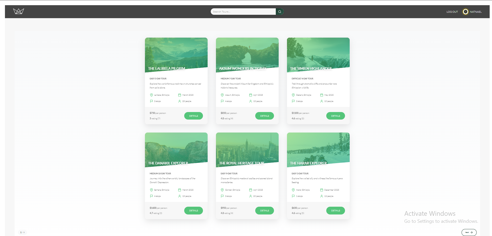
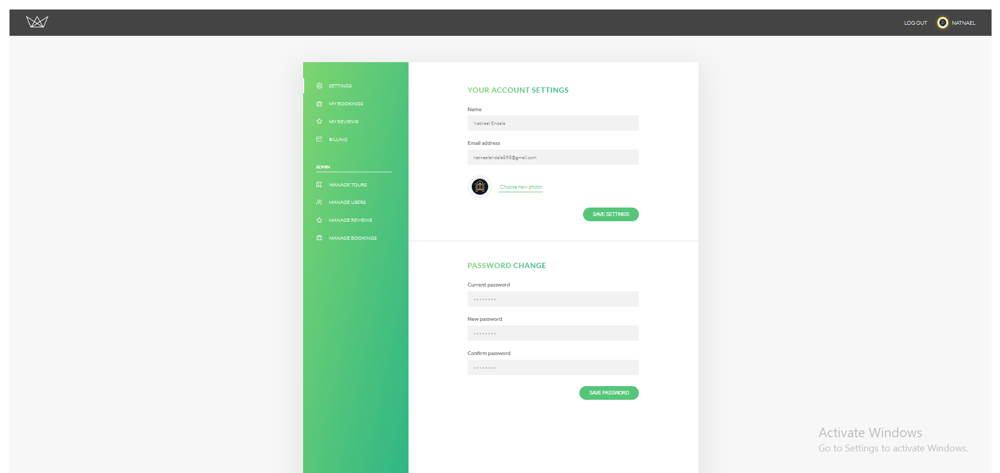

# 🌍 Menbere Tours

A **production-ready full-stack tour booking application** built with **Node.js, Express, MongoDB, and Stripe**.  
The platform allows users to explore tours, book securely online, leave reviews, and manage their bookings.

> Designed with scalable RESTful architecture, secure authentication, and modern backend best practices.

---


---

## 🚀 Live Demo

🔗 _Add your deployed link here (Render / Railway / Heroku)_

---

## ✨ Features

- 🗺️ Browse tours with filtering, sorting, and search
- 👤 User authentication (Signup, Login, Logout)
- 🔐 Secure password reset via email
- ⭐ Tour ratings and reviews
- 🛒 Online booking with Stripe integration
- 💳 Secure payment processing
- 📧 Email notifications
- 🎫 Booking management dashboard
- 📱 Fully responsive design
- ⚡ RESTful API architecture

---

## 🛠 Tech Stack

### Backend

- Node.js
- Express.js
- MongoDB
- Mongoose

### Authentication & Security

- JWT (JSON Web Tokens)
- bcrypt
- Helmet
- express-mongo-sanitize
- xss-clean

### Payments & Email

- Stripe
- MailerSend (or Mailtrap for development)

### Frontend

- Pug Templates
- CSS
- Vanilla JavaScript

---

## 🔐 Security Features

- Password hashing with **bcrypt**
- JWT-based authentication & authorization
- Protected routes & role-based access control
- HTTP security headers with **Helmet**
- NoSQL injection prevention
- XSS protection
- Secure Stripe webhook validation
- Environment variable configuration

---

## 📡 API Overview


## 📦 Installation

### Prerequisites

- Node.js 20+
- MongoDB (Local or MongoDB Atlas)
- npm or yarn

---

### 1️⃣ Clone the Repository

```bash
git clone https://github.com/Natnael-74/MENBERE-TOUR.git
cd MENBERE-TOUR
```

### 2️⃣ Install Dependencies

```bash
npm install
```

### 3️⃣ Environment Configuration

Create a config.env file in the root directory:

```env
NODE_ENV=development
PORT=3000

# Database (MongoDB Atlas)
DATABASE=mongodb+srv://<username>:<password>@cluster0.xxxxxx.mongodb.net/?appName=Cluster0
DATABASE_PASSWORD=<your_password>

# Local Database (optional)
DATABASE_LOCAL=mongodb://localhost:27017/Menbere-Tour

# JWT
JWT_SECRET=<your_secure_random_string>
JWT_EXPIRES_IN=90d
JWT_COOKIE_EXPIRES_IN=90

# Email
EMAIL_HOST=sandbox.smtp.mailtrap.io
EMAIL_PORT=2525
EMAIL_USERNAME=<your_username>
EMAIL_PASSWORD=<your_password>
EMAIL_FROM=your_email@example.com

# Stripe
STRIPE_SECRET_KEY=sk_test_xxx
```

### 4️⃣ Run the Application

Development mode:

```bash
npm run start:dev
```

Production mode:

```bash
npm start
```

Visit:

```bash
http://localhost:3000
```

### 5️⃣ Import Sample Data

```bash
cd dev-data/data
node importDevData.js --import
```

To delete data:

```bash
node importDevData.js --delete
```

---

## 🗂 Project Structure

```
├── config/
├── controllers/
├── models/
├── routes/
├── utils/
├── views/
├── public/
├── dev-data/
├── app.js
├── server.js
└── package.json
```

Architecture follows the MVC (Model–View–Controller) design pattern.

---

## 📸 Screenshots


Example:




---


## 👨‍💻 Author

**Natnael Endale**
Software Engineering Student – Addis Ababa University

GitHub: https://github.com/Natnael-74
